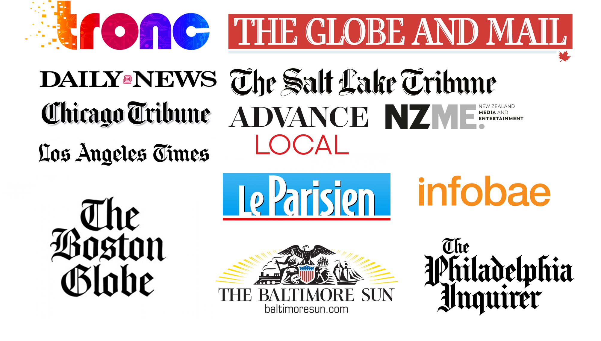
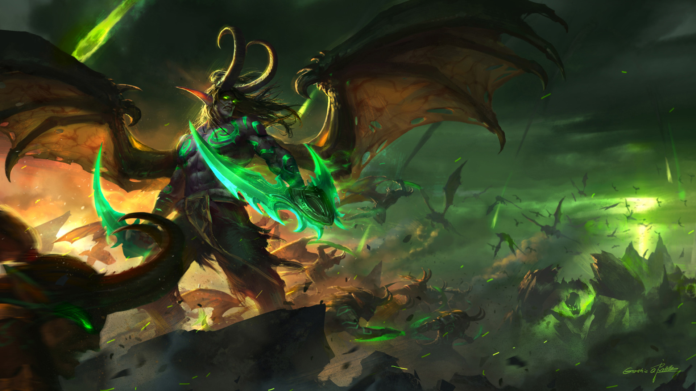

footer: © 2018, Arthur Ariel Sabintsev.<br>ArtSabintsev on [Twitter](https://twitter.com/ArtSabintsev) & [Github](https://github.com/ArtSabintsev).
autoscale: true
slidenumbers: true
theme: Plain Jane, 1
^ Deckset Help: https://docs.decksetapp.com/English.lproj/getting-started.html

<!-- BEGIN TALK -->
# Scaling iOS Architecture
### Arthur Sabintsev<br>Lead iOS Developer<br>The Washington Post

---
<!-- Jeff Bezos -->


---
<!-- Apps (pre-Bezos) -->

# Apps (pre-Bezos Acquisition)


---
<!-- Apps (post-Bezos) -->

# Apps (post-Bezos Acquisition)


---
<!-- Arc Publishing: Logo -->


^ An entity within The Washington Post that builds digital tools for other publishers and technology companies based on the experiences and lessons learned at The Washington Post.

---
<!-- Arc Publishing: Partners -->


---
<!-- Arc Mobile: Intro -->
> _The Washington Post is now building and maintaining native mobile apps for other newspaper publishers._

---
<!-- Arc Mobile: Unicorn -->

# Project Unicorn [^1] [^2]
## _(aka: The White Label App, Arc Mobile, Arc Native)_


[^1]: Image Credit: [Unicorn King](https://rubymight.deviantart.com/art/Unicorn-King-207067300) by [rubymight](https://rubymight.deviantart.com)

[^2]: Unofficial (Internal) Logo

---
<!-- Arc Mobile: Unicorn-Pitch App -->

# What is the Unicorn / Arc Mobile app?

Unicorn was pitched to be a clone of The Washington Post Classic app.


---
<!-- Arc Mobile: Unicorn-Powered App -->


---
<!-- Arc Mobile: Unicorn-Powered App Examples -->

# Unicorn-Powered Apps

   

---
<!-- Not Prepared -->

# We were not prepared!



_Image: [Qichao Wang on ArtStation](https://qichaowang.artstation.com/projects/05VE8)_

---
<!-- Crashlytics -->

# Though we've done a decent job


---
<!-- Structure of News App 1 -->

# Structure of a News App

``` [.highlight: 1]
- Section Fronts
- Articles
- Section List
- Search
- Saved Articles
- Segmented Push Notifications
```


---
<!-- Structure of News App 2 -->

# Structure of a News App

``` [.highlight: 2]
- Section Fronts
- Articles
- Section List
- Search
- Saved Articles
- Segmented Push Notifications
```


---
<!-- Structure of News App 3 -->

# Structure of a News App

``` [.highlight: 3]
- Section Fronts
- Articles
- Section List
- Search
- Saved Articles
- Segmented Push Notifications
```


---
<!-- Structure of News App 4 -->

# Structure of a News App

``` [.highlight: 4]
- Section Fronts
- Articles
- Section List
- Search
- Saved Articles
- Segmented Push Notifications
```


---
<!-- Structure of News App 5 -->

# Structure of a News App

``` [.highlight: 5]
- Section Fronts
- Articles
- Section List
- Search
- Saved Articles
- Segmented Push Notifications
```


---
<!-- Structure of News App 6 -->

# Structure of a News App

``` [.highlight: 6]
- Section Fronts
- Articles
- Section List
- Search
- Saved Articles
- Segmented Push Notifications
```


---
<!-- Unicorn: Customization -->

# App Customization Options

- Ad Provider(s)
- Analytics Provider(s)
- Paywall Provider
- Push Notification Provider
- Theming (Colors, Fonts, Images, Paragraph Styles)
- Traffic Provider
- Weather Provider

---
<!-- Unicorn: High-Level Architecture Diagram -->

# High-Level Architecture of a Unicorn App


---
<!-- Unicorn Partner Struct -->

# Partner.swift

```swift
struct Partner {
  static let shared = Partner()
  struct Colors {...}
  struct Fonts {...}
}

extension Partner: AnalyticsManaging {...}
extension Partner: AdsManging {...}
extension Partner: PartnerManaging {...}
extension Partner: PaywallManaging {...}
extension Partner: PushManaging {...}
extension Partner: Themeable {...}
/// etc.
```

^ Mention Partner+ Classes. Mention Themeable (in this doc) is actually a grouping of many extensions

---
<!-- Partner+PartnerManaging Struct -->

# Partner+PartnerManaging.swift

```swift
extension Partner: PartnerManaging {

  // Feature Toggles
  var isOfflineModeEnabled: Bool { get }
  var isPaywallEnabled: Bool { get }
  var isSearchEnabled: Bool { get }

  // Legal Toggles
  var requiresTrackingConsent: Bool { get } // GDPR

  // Cost-Saving Toggles
  var searchOnUserInput: Bool { get } // e.g., Typeahead

  /// and many more (seriously, tons of knobs to tweak)!
}
```

---

# Partner Setup

```swift
// PartnerAppDelegate.partner
override var partner: Any {
    return Partner.shared
}

// CoreAppDelegate().setupPartner()
open func setupPartner() {
    PartnerManager.currentPartner = partner as? PartnerManaging
                                    ?? PartnerManager.currentPartner

      // etc.
}

// PartnerManager.swift
public struct PartnerManager {
    public static var currentPartner: PartnerManaging = DefaultPartner()
}

// PartnerManaging.swift
public struct DefaultPartner: PartnerManaging {
    // Default PartnerManaging Implementation
}
```
---
<!-- Theming -->

# Protocol Oriented Theming


- AppThemeable
- ArticleThemeable
- ImageThemable
- NavigationThemeable
- PaywallThemeable
- PushThemeable

_All of these have default implementations_
---
<!-- ArticleThemeable Example -->

# ArticleThemeable Example

## _"Handcrafted, Artisanal Content Theming"_

```swift
typealias ArticleThemeResults = [String: Any]

var pageBodyBoldItalicFont: UIFont {
    return UIFont(name: Partner.Fonts.boldItalic, size: 18.0)
           ?? UIFont.systemFont(ofSize: 18)
}

var paragraphBlockquote: ArticleThemeResults {
    let paragraphStyle = NSMutableParagraphStyle()
    paragraphStyle.hyphenationFactor = 1.0
    paragraphStyle.lineSpacing = 5.2
    paragraphStyle.paragraphSpacingBefore = 18
    paragraphStyle.firstLineHeadIndent = 26
    paragraphStyle.headIndent = 26

    return [NSAttributedStringKey.font.rawValue: pageBodyItalicFont,
            NSAttributedStringKey.foregroundColor.rawValue: UIColor.black,
            NSAttributedStringKey.paragraphStyle.rawValue: paragraphStyle]
}
```

---
<!-- Theming (Problems) -->

# Problems with Existing Solution

- Current implementation does not scale as there are hundreds of knobs.
- Default protocol implementations make it hard to discover:
  - Renamed variables
  - New variables
  - Deprecated methods ([Swift Forums Post](https://forums.swift.org/t/how-do-you-properly-deprecate-a-method-in-a-protocol/13347/8))

---
<!-- Theming (Future) -->

# Future of Theming


## `Codable`-backed JSON files
- **Style.json**
    - A list of *all* the _tweakable_ elements, broken up in a declarative way by view, VC, and element type.
- **SuperStyle.json**
    - A superset of _tweakable_ elements that are customized and _trickle down_ to all the values defined in `Style.json`.

_Image: Andrew Schoenfeld, Classic App Maintainer_

---
<!-- Entities -->

# Entities

A generic front-end that performs CRUD operations on Codable-conforming models.

- Persists configuration files
- Persists user data
  - Saved Articles
  - Push Notifications
- Scales to store any codable model


---
<!-- Entities: Abstract Example -->

# Entities: Abstract Example

```swift
public var main: MainConfig? { /// Example: Main Configuration File
    get {
        return getValue(MainConfig.self, for: .main)
    } set {
        setValue(for: .main, toNewValue: newValue)
    }
}

public func getValue<T: Codable>(_ type: T.Type = T.self, for options: Options,
                                 environmentOverride environment: Environment = EnvironmentManager.shared.current) -> T? {
    let key = coordinatorsKey(for: options, environment: environment)
    let coordinator = getCoordinator(for: key) as? PersistenceCoordinator<T> ??
        PersistenceCoordinator<T>(for: options, environmentOverride: environment)
    setCoordinator(coordinator, forKey: key)
    return coordinator.read()
}

public func setValue<T: Codable>(for options: Options, toNewValue newValue: T?,
                                 environmentOverride environment: Environment = EnvironmentManager.shared.current) {
    let key = coordinatorsKey(for: options, environment: environment)
    let coordinator = getCoordinator(for: key) as? PersistenceCoordinator<T> ??
        PersistenceCoordinator<T>(for: options, environmentOverride: environment)
    coordinator.update(with: newValue)

    setCoordinator(newValue != nil ? coordinator : nil, forKey: key)
}
```

---
<!-- Environment Switching -->

# Environment Switching

- Built on top of **Entities**, environment switching allows partners to test their app against production, staging, and development environments.
- Useful for testing:
  - Section front layouts
  - Paywall API changes

- In the past we had to deploy new TestFlight builds whenever they wanted to test against a different environment.


---
<!-- CocoaPods (AnalyticsKit) -->


# CocoaPods (AnalyticsKit)

```swift
s.static_framework = true
s.swift_version = '4.1'

s.ios.deployment_target = 9.0
s.tvos.deployment_target = 9.0

s.default_subspec = 'Core'
s.subspec 'Core' do |sub|
  sub.source_files = 'Sources/Core/**/*'
end

s.subspec 'ComScore' do |sub|
  sub.dependency 'AnalyticsKit/Core'
  sub.ios.dependency 'ComScore'
  sub.source_files = 'Sources/ComScore'
end

s.subspec 'Firebase' do |sub|
  sub.dependency 'AnalyticsKit/Core'
  sub.ios.dependency 'FirebaseAnalytics', '>= 4'
  sub.ios.source_files = 'Sources/Firebase'
end

s.subspec 'Omniture' do |sub|
  sub.dependency 'AnalyticsKit/Core'
  sub.ios.dependency 'AdobeMobileSDK', '>= 4.15.0'
  sub.tvos.dependency 'AdobeMobileSDK/TVOS', '>= 4.8.1'
  sub.source_files = 'Sources/Omniture'
end

// Any many many more!
```

---
<!-- BuddyBuild -->

# BuddyBuild

- Built for _mobile_ developers with both CI and CD and **_just works_!<sup>TM</sup>**
- Deploys to ~~iTunes~~ App Store Connect automatically with custom rules.
- No need to maintain _fastlane_ scripts or `yaml` files across dozens of repos.
- Only CI that did not fail during our tests (seriously - we spent a month)
  - We tested `circle`, `travis`, `bitrise`
  - We tested Xcode Bots on a Mac Mini (in 2015-2017) 😆 😂 🤣

---
<!-- BuddyBuild White Paper -->

# We ❤️ BuddyBuild!


---
<!-- Open Source Decision Making -->

# **Thoughts on Open Source**

## I ❤️ contributing to Open Source.
## I rarely use other people's Open Source tools.
## _Why?_

---
<!-- Open Source Tools -->

# Open Source Tools We Use [^3]

| 3<sup>rd</sup> Party | 3<sup>rd</sup> Party | 1<sup>st</sup> Party
| :---: | :---: | :---: |
| CocoaLumberjack | RNCryptor | Failable
| Eureka | SVProgressHUD | Freedom |
| Mockingjay | XCDYouTubeKit | Siren |

[^3]: Not listed here are base required SDKs (Ad SDKs, Analytics SDKs, Crash Monitoring, etc.)

---
<!-- What's Next? -->

# What's Next?

- Arc Mobile SDK Offering
- Automating Upstream PRs
- I18n and L10n
- Spin-up Apps with a push of a button via a web admin portal
- Theming Engine Rewrite
- Unified Configuration Files

---
<!-- Architecture -->

# Architecture

- Native Development (Swift+Objc & Kotlin+Java)
- Model-View-Controller (MVC)
- Builders, View-Models, etc
- POP (Protocol-Oriented-Programming)

---
<!-- Process -->

# Process

- Git Strategies
  - GitFlow
  - All code comes in via a detailed Pull Request
  - Pull Request Templates
  - Pair Programming for Code Reviews
- Rituals
  - Daily Scrum
  - Daily Check-in
  - Weekly Kanban

---
<!-- The Team -->

# Team Structure
## Big proponents of remote work!

- 1 Lead (Baltimore)
- 3 Seniors (DC, Denver, Tallahassee)
- 2 Juniors/Mid (Cincinnati, Manhattan)
- 1-2 interns in DC every summer

---
<!-- The Team at iOSDevCamp -->

# WaPo @ iOSDevCampDC 2018


#### Mac, Dustin, Josip, Arthur, Erik

---
<!-- Thank You -->

# Thank You!


### [https://github.com/ArtSabintsev/iOSDevCampDC-2018](https://github.com/ArtSabintsev/iOSDevCampDC-2018)
